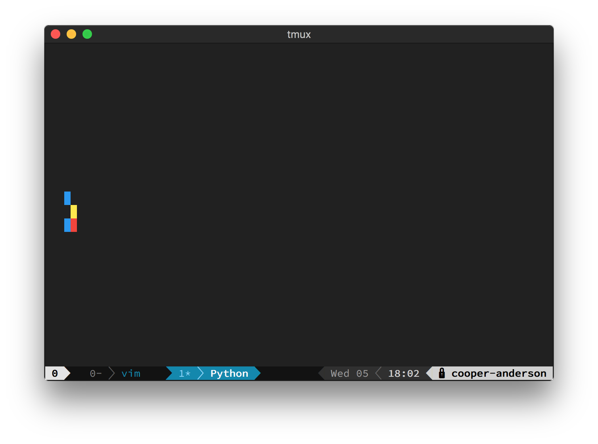

# gameoflife-rgb
Game of Life compressed into the rgb channels of each pixel

## How to use
Clone the repository and enter it by using this command
```bash
git clone https://github.com/cooper-anderson/gameoflife-rgb;
cd gameoflife-rgb;
```

Now run `rgb.py` by running one of these commands
```bash
python rgb.py
```
or
```bash
./rgb.py
```

Note that for the second one, you may need to enable permissions

## How it works
The actual Game of Life that is running here is just running like normal. However, the way it is being displayed is different. Instead of having each cell on the grid correspond to one pixel, I switched it so that 3 cells correspond to one pixel, and those three cells determine if the RGB values of that pixel are on or off. Since there are only 2 states for each of the 3 bits, that gives us 8 total color combinations. Those being in order: black, blue, green, cyan, red, magenta, yellow and white.

## Controls
`q` - Quit out of the program

`r` - Generate new random grid

`c` - Clear current grid

`g` - Generate a glider in the top left

## Screenshots



## Credits
Inspiration goes to [Cary Huang](https://www.youtube.com/user/carykh) for his recent video on computer generated jazz music. He used the same way of displaying pixels for showing midi for the neural net. I found this very interesting and wanted to expand upon the idea.

I might continue this project and add support for [Stephen Wolfram's Rule 135](https://en.wikipedia.org/wiki/Rule_30) in addition to [John Conway's Game of Life](https://en.wikipedia.org/wiki/Conway%27s_Game_of_Life).

